## Figure 1 (fig:dendrograms)

 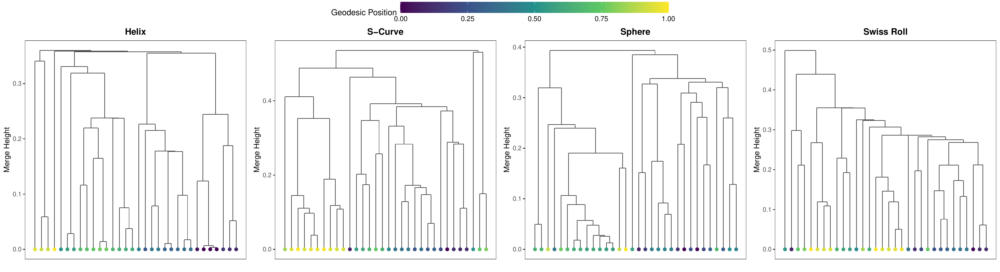

**Caption**

**Single-trial AHC dendrograms for four artificial datasets.**
We sample $N\ =\ 300$ points from each manifold (Helix, S-Curve, Sphere, Swiss Roll)
and build a single AHC tree via random subsampling with subsample size $\psi\ =\ 32$
and single linkage. Each leaf represents one of the 32 randomly subsampled data points.
Leaf nodes are coloured by their *geodesic position*: arc length for Helix;
first intrinsic coordinate for S-Curve and Swiss Roll; azimuthal angle for Sphere,
normalised to $[0,1]$ and mapped to a viridis colour scale. For the Helix and S-Curve, the dendrograms show that geodesically nearby points (similar colours) are merged at low heights, while
geodesically distant points (contrasting colours) are only joined at higher levels.
The Sphere and Swiss Roll show broader colour mixing at higher merge levels, but local
geodesic clusters are still clearly visible within subtrees, showing the AHC
tree preserves geodesic locality even in a single trial.

## Figure 2 (fig:cophenetic_scatter)

 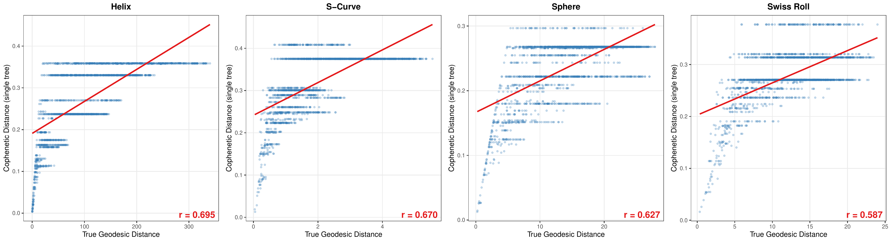

**Caption**

**Cophenetic distance versus true geodesic distance (single AHC tree).**
For each manifold ($N\ =\ 300$), a single AHC tree is constructed with $\psi\ =\ 64$
and single linkage. For every pair of subsampled points ($\binom{64}{2}\ =\ 2016$ pairs),
we compute the **cophenetic distance (the merge height at which the two points first join
in the dendrogram)** and the true geodesic distance. Each dot is one pair; the red line
is a linear regression fit, with Pearson $r$ annotated. Pearson $r$ measures *linear* association only. A moderate $r$
does not imply failure to preserve the geodesic *rank ordering*. We report Pearson $r$ as a
conservative guarantee. All four manifolds exhibit clear positive correlation. Single-tree cophenetic estimates are more reliable
for local neighbours than for distant pairs. This increasing variance at large
distances motivates the ensemble averaging strategy in Figure 4.

## Figure 3 (fig:cophenetic_distribution)

 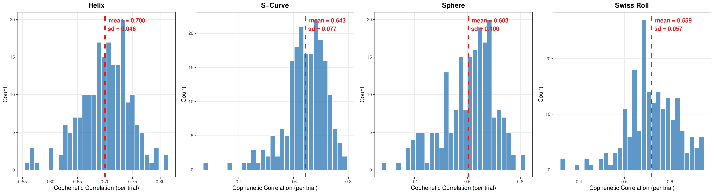

**Caption**

**Distribution of cophenetic correlations across $t\ =\ 200$ Monte-Carlo trials.**
We repeat the single-tree cophenetic correlation measurement
(as in Figure 2) independently $t\ =\ 200$ times, each with
a random subsample ($\psi\ =\ 64$, single linkage). The histogram shows the
distribution of Pearson $r$ values across trials; the dashed red line marks the mean. All four manifolds yield consistently positive correlations,the distributions are concentrated well above zero and roughly unimodal.

## Figure 4 (fig:aggregation)

 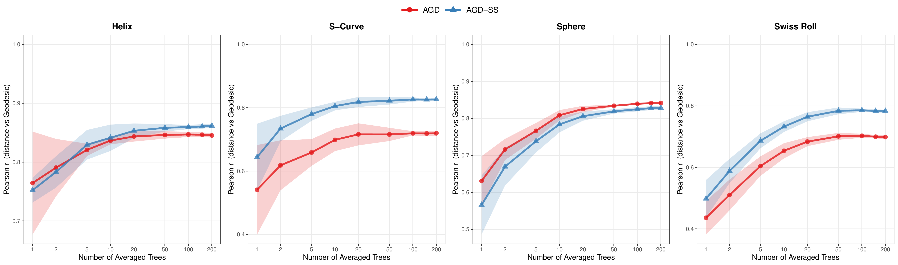

**Caption**

**Aggregation effect: Pearson correlation versus number of averaged trees $t$.**
For each manifold ($N\ =\ 300$), we build forests of up to $T\ =\ 200$ independent AHC
trees ($\psi\ =\ 64$, single linkage). Two distance definitions are compared:
**AGD** and **AGD-SS**.
Solid lines show the mean Pearson $r$ across 10 independent repetitions; shaded
bands show standard deviation, quantifying the variance due to random
subsampling.

## Figure 5 (fig:heatmap_helix)

 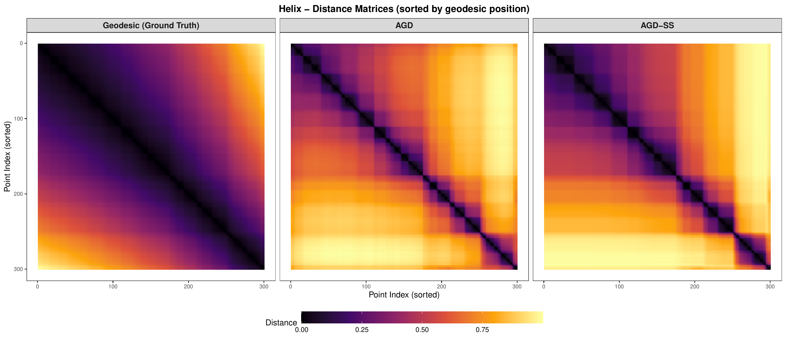

**Caption**

**Distance matrix heatmaps for the Helix manifold.**
The full $300 \times 300$ pairwise distance matrices are computed using $\psi\ =\ 64$
and $t\ =\ 200$ trees with single linkage. Rows and columns are sorted by geodesic
position (arc length), and each matrix is normalised to $[0,1]$.
Left: ground-truth geodesic distance; Centre: AGD ($r\ =\ 0.848$); Right: AGD-SS
($r\ =\ 0.863$).

## Figure 6 (fig:heatmap_scurve)

 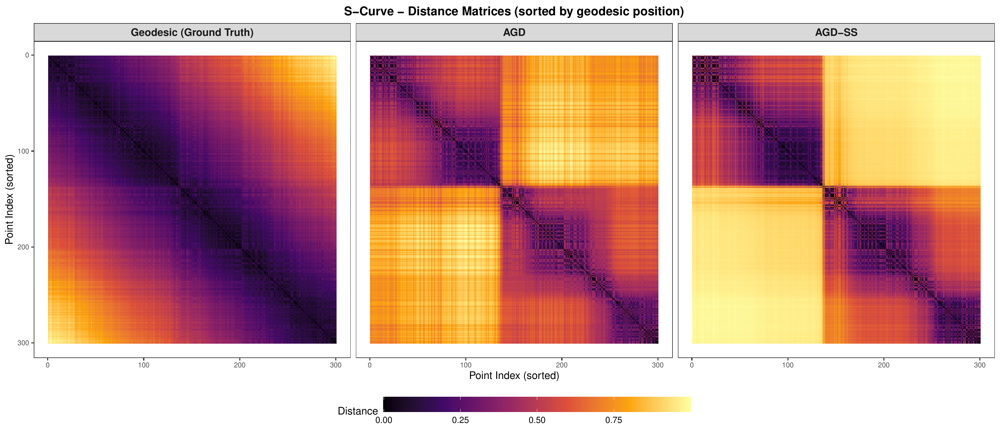

**Caption**

**Distance matrix heatmaps for the S-Curve manifold.**
Same protocol as Figure 5: $N\ =\ 300$, $\psi\ =\ 64$,
$t\ =\ 200$ trees, single linkage. The geodesic distance is computed via $k$-NN graph
shortest paths ($k\ =\ 10$). Matrices are sorted by the first intrinsic coordinate. Left: ground-truth geodesic distance; Centre: AGD ($r\ =\ 0.716$); Right: AGD-SS
($r\ =\ 0.821$).

## Figure 7 (fig:heatmap_sphere)

 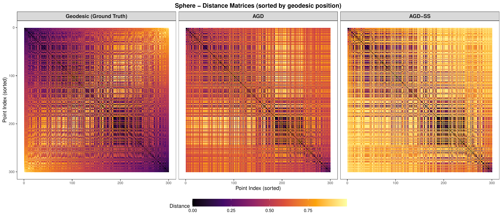

**Caption**

**Distance matrix heatmaps for the Sphere manifold.**
Same protocol: $N\ =\ 300$, $\psi\ =\ 64$, $t\ =\ 200$ trees, single linkage.
Matrices are sorted by azimuthal angle. Left: ground-truth geodesic distance; Centre: AGD ($r\ =\ 0.838$); Right: AGD-SS
($r\ =\ 0.827$).

## Figure 8 (fig:heatmap_swiss_roll)

 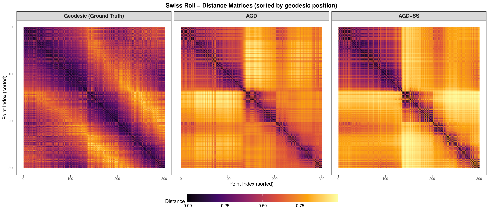

**Caption**

**Distance matrix heatmaps for the Swiss Roll manifold.**
Same protocol: $N\ =\ 300$, $\psi\ =\ 64$, $t\ =\ 200$ trees, single linkage.
The geodesic distance is computed via $k$-NN graph shortest paths ($k\ =\ 10$);
matrices are sorted by the unrolled position. Left: ground-truth geodesic distance; Centre: AGD ($r\ =\ 0.676$); Right: AGD-SS
($r\ =\ 0.767$). The Swiss Roll is the most challenging
manifold due to its tight spiral, where Euclidean-close points from different layers
are geodesically distant.

## Figure 9 (fig:am_aggregation)

 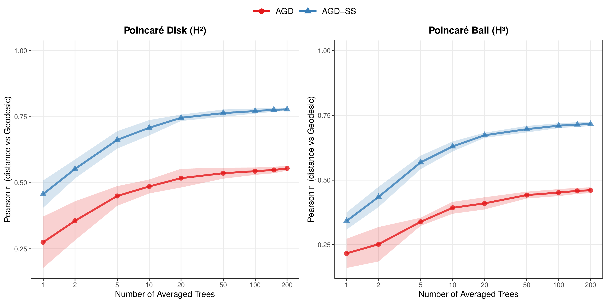

**Caption**

**Aggregation effect on hyperbolic manifolds**
($\psi\ =\ 64$, single linkage, 10 repetitions, $\pm \sigma$ bands).
Red: **AGD**; Blue: **AGD-SS**.
On **H2**, AGD-SS outperforms AGD consistently over different number of trees.

## Figure 10 (fig:am_heatmap_poincare)

 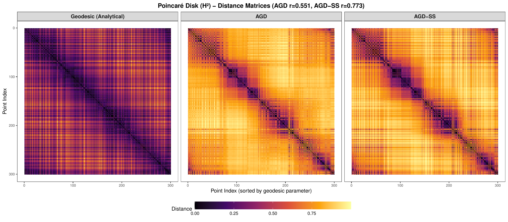

**Caption**

**Distance matrix heatmaps for Poincaré Disk (H2**).
$300\ \times\ 300$ pairwise distance matrices ($\psi\ =\ 64$, $t\ =\ 200$, single
linkage), sorted by angular position and normalised to $[0,1]$.
Left: **exact hyperbolic geodesic**; Centre: **AGD** ($r\ =\ 0.551$);
Right: **AGD-SS** ($r\ =\ 0.773$).

## Figure 11 (fig:am_heatmap_ball)

 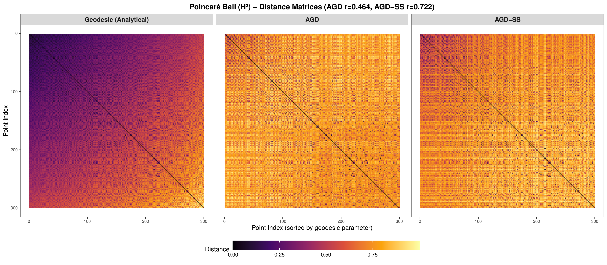

**Caption**

**Distance matrix heatmaps for Poincaré Ball (H3**).
$300\ \times\ 300$ pairwise distance matrices ($\psi\ =\ 64$, $t\ =\ 200$, single
linkage), sorted by radial distance from the origin and normalised to $[0,1]$.
Left: **exact hyperbolic geodesic**; Centre: **AGD** ($r\ =\ 0.464$);
Right: **AGD-SS** ($r\ =\ 0.722$).

## Figure 12 (fig:hyperbolic_precision)

 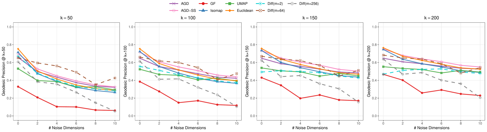

**Caption**

**Geodesic Precision on the Poincaré Ball
(H3**) at $k\ =\ 50,\,100,\,150,\,200$
($N\ =\ 1000$, noise constant $=20$).
Here we use the same parameter setting as in the main paper (Figure 3).
Each panel shows a different evaluation neighbourhood size $k$. **Diffusion ($m\ =\ 64$)** is the most noise-robust method when $k\ \leq\ 100$,
but its performance collapses at higher noise levels and larger $k$ values.
**AGD-SS** performs better when $k$ is larger ($k\ =\ 200$).
GF performs poorly throughout ($\le 0.47$), confirming its
difficulty with hyperbolic geometry.

## Figure 13 (fig:manifold_local_correlation)

 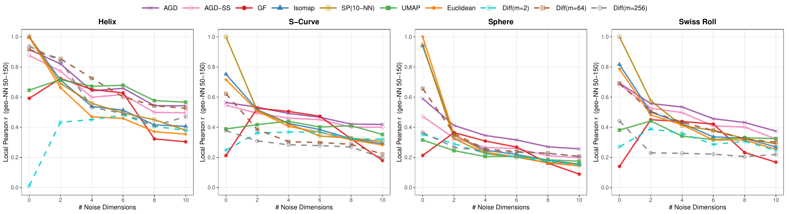

**Caption**

**Pearson correlation with true geodesic distance on
four manifolds** ($N\ =\ 1000$, noise constant $=20$,
noise dims $\in\{0,2,4,6,8,10\}$).
In order to align with the same setting of Figure 3 in our main paper, for each point $x_i$ we identify its $50$th--$150$th nearest
neighbours under the true geodesic (a set $S_i$ of $101$ points)
and compute the Pearson $r$ between the estimated and true geodesic
distances to $S_i$.  The plotted value is the average over all
$N$ points.
Ten methods are compared: the nine from Figure 3 in the main paper,
plus **SP(10-NN)**, which computes shortest-path
distances on a $10$-NN graph without the classical MDS embedding
step used by Isomap. In Sphere and Swiss Roll, AGD-SS outperforms other methods.

## Figure 14 (fig:pointwise_concentration)

 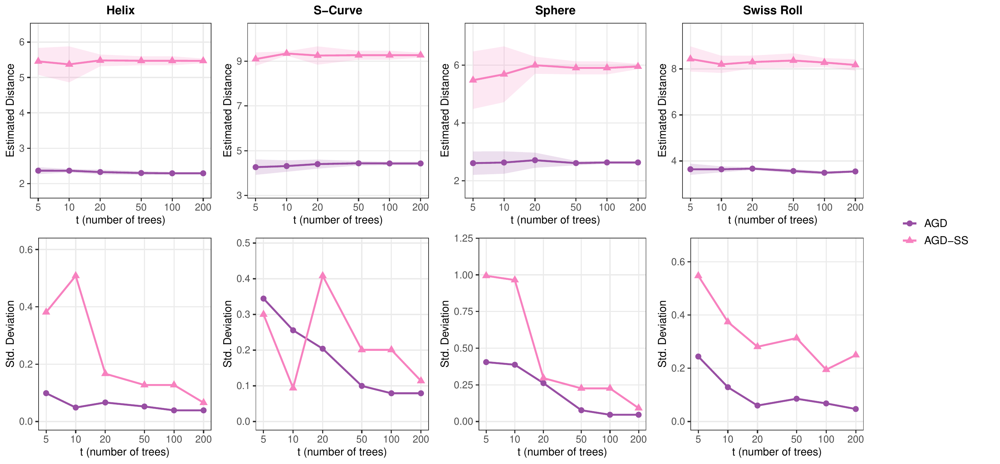

**Caption**

**Pointwise concentration of AGD and AGD-SS for a single
pair of points**
($5$ independent runs).
One pair $(i,j)$ was randomly was selected and held fixed across all runs.
**Top row:** mean estimated pairwise distance $\pm$ one
standard deviation (shaded).
**Bottom row:** standard deviation of the estimate across
the $5$ runs.

## Figure 15 (fig:pairwise_concentration)

 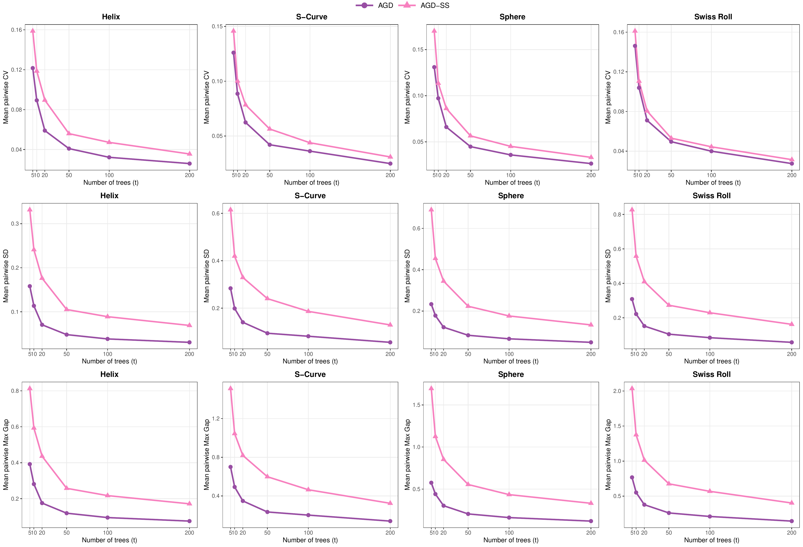

**Caption**

**Pairwise concentration across all $\binom{N}{2}$ point pairs**
($N\ =\ 300$, $\psi\ =\ 64$, single linkage, $R\ =\ 5$ independent runs).
Let $\hat{d}_{ij}^{(r)}$ denote the estimated distance between
points $i$ and $j$ in the $r$-th independent run
($r = 1,\dots,R$).  Define the per-pair mean
$\mu_{ij} = \frac{1}{R}\sum_{r=1}^{R}\hat{d}_{ij}^{(r)}$,
standard deviation
$\sigma_{ij} = \bigl[\frac{1}{R-1}\sum_{r=1}^{R}
(\hat{d}_{ij}^{(r)} - \mu_{ij})^{2}\bigr]^{1/2}$,
coefficient of variation
$\mathrm{CV}_{ij} = \sigma_{ij}\,/\,\mu_{ij}$,
and max gap
$\mathrm{MG}_{ij} = \max_{r}\hat{d}_{ij}^{(r)}
- \min_{r}\hat{d}_{ij}^{(r)}$.
All statistics below are averaged over the
$\binom{N}{2}$ pairs.
**Top row (Mean Pairwise CV):**
$\overline{\mathrm{CV}}(t)
= \binom{N}{2}^{-1}\ \sum_{i<j}\mathrm{CV}_{ij}$,
the mean coefficient of variation as a function of the number of
trees $t$.
**Middle row (Mean Pairwise SD):**
$\bar{\sigma}(t)
= \binom{N}{2}^{-1}\ \sum_{i<j}\sigma_{ij}$,
the mean raw standard deviation (unnormalised) across all pairs.
**Bottom row (Mean Pairwise Max Gap):**
$\overline{\mathrm{MG}}(t)
= \binom{N}{2}^{-1}\ \sum_{i<j}\mathrm{MG}_{ij}$,
the mean of the per-pair range (maximum minus minimum) over $R$
runs, measuring the worst-case single-run deviation for a typical
pair.

## Figure 16 (fig:concentration)

 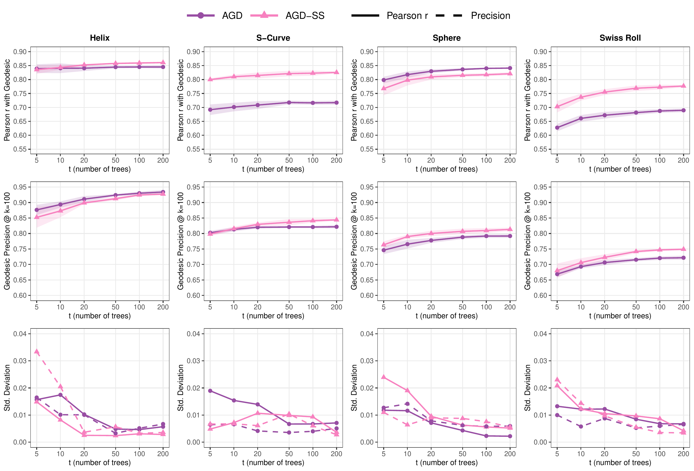

**Caption**

**Concentration of AGD and AGD-SS as a function of $t$
(number of trees)**
($5$ independent runs).
**Top row:** Pearson $r$ with the true geodesic distance
matrix.
**Middle row:** Geodesic Precision at $k\ =\ 100$.
**Bottom row:** Standard deviation across the $5$ runs
(solid = Pearson $r$, dashed = Precision).
Shaded bands in the top two rows denote standard deviation.

